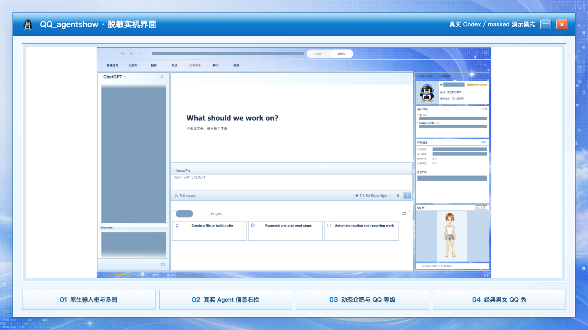
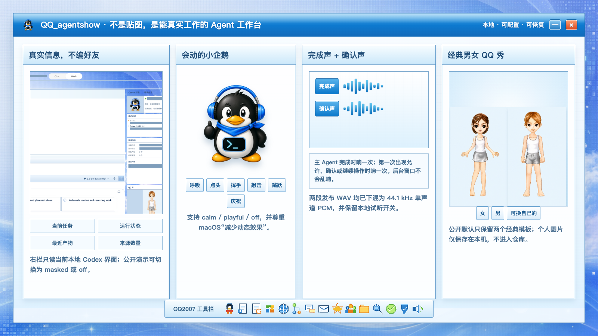

<p align="center">
  
</p>

<h1 align="center">QQ_agentshow</h1>

<p align="center">
  给 macOS Codex Desktop 装上一套会动、会提醒、能真实工作的 QQ2006 / 2007 Agent 界面。
</p>

<p align="center">
  <a href="https://github.com/tangyihang-jiayou/QQ_agentshow/releases/latest"></a>
  <a href="https://github.com/tangyihang-jiayou/QQ_agentshow/actions/workflows/ci.yml"></a>
  <a href="LICENSE"></a>
  
  
</p>

> [!IMPORTANT]
> 这是非官方怀旧项目，与 OpenAI、Tencent、QQ 无隶属或授权关系。它不会修改 `ChatGPT.app` / `Codex.app`、`app.asar` 或应用代码签名。

## 这是什么

QQ_agentshow 不是一张盖在 Codex 上面的 QQ 贴图，也不会编造“AI 好友”。它保留 Codex 原生任务、项目、附件、审批、模型和权限控件，同时增加一套可随时关闭的 QQ2007 工作台：

- 右栏读取**当前本地 Codex** 的任务状态、最近产物、来源和最近对话。
- 透明小企鹅会呼吸、点头、挥手、敲击、跳跃；完成任务时会庆祝。
- 主 Agent 完成任务播放完成声；需要允许、确认或继续时播放确认声。
- 多图上传前可逐张删除，发送后按原比例进入响应式画廊。
- 经典男女 QQ 秀、QQ 等级、签名和三套右栏布局均可配置。
- 所有改动都在用户目录，能暂停、换回官方界面或完整恢复。

<p align="center">
  
</p>

<p align="center"><sub>真实 Codex Desktop 截图；项目名、对话和本机信息使用不可逆实色遮罩。<a href="docs/images/qq-agentshow-ui-sanitized.png">查看原始脱敏截图</a>。</sub></p>

## 30 秒安装

支持 macOS 上的官方 ChatGPT / Codex Desktop。第一次安装前，请先正常打开一次 Codex，再从菜单栏**完全退出**。

```bash
/bin/bash -c "$(curl -fsSL https://raw.githubusercontent.com/tangyihang-jiayou/QQ_agentshow/v2.1.1/install.sh)"
```

安装完成后重新打开 Codex。顶部会出现「换肤」，右侧会出现「Codex 好友 / 环境信息」工作台。

想先看清会写入哪些文件，可以使用[审阅后安装](docs/INSTALLATION.md)。安装遇到问题先看[故障排查](docs/TROUBLESHOOTING.md)。

> [!TIP]
> 更新 Codex 后皮肤暂时消失时，通常不需要重装应用。重新运行上面的固定版本安装命令，再打开 Codex 即可；你的昵称、签名、布局和自定义图片会保留。

## 一眼看懂主要能力

<p align="center">
  
</p>

| 能力 | 实际行为 |
| --- | --- |
| 真实 Agent 信息 | 只读当前任务、运行状态、产物、来源和最近对话；不伪造好友或数字 |
| 多图可用 | 上传前独立预览与删除；发送后保留比例，在不同缩放下自动换列 |
| 动态企鹅 | `calm` / `playful` / `off` 三档；尊重 macOS“减少动态效果” |
| 完成声 | 主 Agent 从运行转为完成时响一次；企鹅同步庆祝 |
| 确认声 | 第一次出现原生允许 / 确认 / 继续操作时响一次 |
| 隐私演示 | 最近对话支持 `real` / `masked` / `off`，截图或直播建议使用后两种 |
| 恢复 | 不改应用包；一条命令切回官方界面并关闭本地调试端口 |

## 右栏怎么排

右栏顶部始终是企鹅资料和真实最近对话，中间连续显示环境与产物，QQ 秀固定放在下方，不再留下断层。

| 模板 | 内容重点 | 适合场景 |
| --- | --- | --- |
| `classic-chat` | 企鹅 → 最近对话 → 环境信息 → QQ 秀 | 默认，最像经典 QQ |
| `workbench` | 压缩最近对话，为环境和产物让出空间 | 编程、长任务 |
| `minimal` | 隐藏最近对话，保留环境与 QQ 秀 | 小屏、专注模式 |

右栏可以展开、收起或关闭；小窗口会自动改为紧凑布局。

## 换昵称、签名和动作

下面这条命令会切到工作台布局、活泼企鹅和脱敏最近对话，同时开启完成提示音：

```bash
~/.codex/codex-dream-skin-studio/scripts/personalize-codex-2007-macos.sh \
  --agent-layout workbench \
  --pet-motion playful \
  --conversation-preview masked \
  --completion-sound on
```

昵称默认读取你自己的 Codex 资料；签名提供经典模板，也可以改成自己的。公开默认 QQ 秀只有「女 / 男」两个历史模板，不包含维护者个人入口；自定义企鹅和 QQ 秀只保存在你的电脑里。

完整选项见[配置手册](docs/CONFIGURATION.md)。

## 声音什么时候响

| 场景 | 行为 |
| --- | --- |
| 主 Agent 从运行转为完成 | 播放完成声，企鹅跳一下 |
| 页面第一次出现允许 / 拒绝 / 确认 / 继续 / 运行 / 提交操作 | 播放确认声 |
| 同一张确认卡继续重绘 | 不重复播放 |
| Codex 在后台、隐藏或窗口未聚焦 | 不播放 |

底部状态栏可以分别试听或关闭两种声音。发布 WAV 为 44.1 kHz、16-bit、单声道 PCM，并经过首尾淡化、直流偏移与硬削波检查。历史声音的权利边界见 [NOTICE](NOTICE.md) 和[素材溯源](macos/references/asset-provenance.md)。

## 隐私、安全与恢复

- 对话预览和环境信息只从当前本地 Codex 界面读取，不上传，也不写回仓库。
- 安装器只使用官方应用内签名有效的 Node.js，不下载额外运行时。
- CDP 只绑定数值回环地址，并验证监听进程和目标属于官方应用；调试端口没有独立认证，不建议和不可信的本地软件同时使用。
- 公开发布检查会扫描用户目录、邮箱、令牌、私钥形态和未登记素材；图片还要逐张人工检查像素。
- 随时点顶部「换肤」切回原生界面；完整恢复运行：

```bash
~/.codex/codex-dream-skin-studio/scripts/restore-dream-skin-macos.sh \
  --restore-base-theme --restart-codex
```

更多细节见[隐私说明](docs/PRIVACY.md)、[安装说明](docs/INSTALLATION.md)和[平台支持](docs/platforms.md)。产品边界与发布门槛统一维护在[发布需求与验收标准](docs/RELEASE-REQUIREMENTS.md)。

## 作为 Codex Skill 使用

仓库根目录的 [SKILL.md](SKILL.md) 是正式的 `QQ_agentshow` Skill 入口。把仓库地址交给 Codex，它可以依照这份 Skill 完成预检、安装、配置、验证、排错和恢复；整个流程只引用仓库内可审阅的脚本。

## 开发与发布检查

```bash
cd macos
npm test
npm run privacy
npm run assets:check
npm run skill:check
```

README 图片可由 [`docs/visuals/render-readme-assets.sh`](docs/visuals/render-readme-assets.sh) 从真实脱敏截图与仓库内素材重新生成。

## 来源与许可

本项目从 [Fei-Away/Codex-Dream-Skin](https://github.com/Fei-Away/Codex-Dream-Skin) 的 macOS 运行引擎继续开发，软件代码沿用 MIT License。

默认企鹅、QQ 秀和提示音是维护者选择的历史 QQ 时代怀旧素材，并非项目原创或腾讯官方授权；它们不属于 MIT 授权范围。`Codex`、`OpenAI`、`QQ`、`Tencent` 及相关标识归各自权利人所有。详见 [NOTICE](NOTICE.md) 与[素材来源记录](macos/references/asset-provenance.md)。
