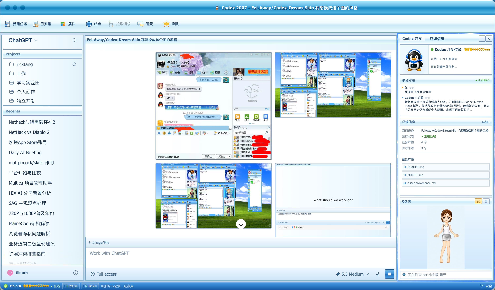
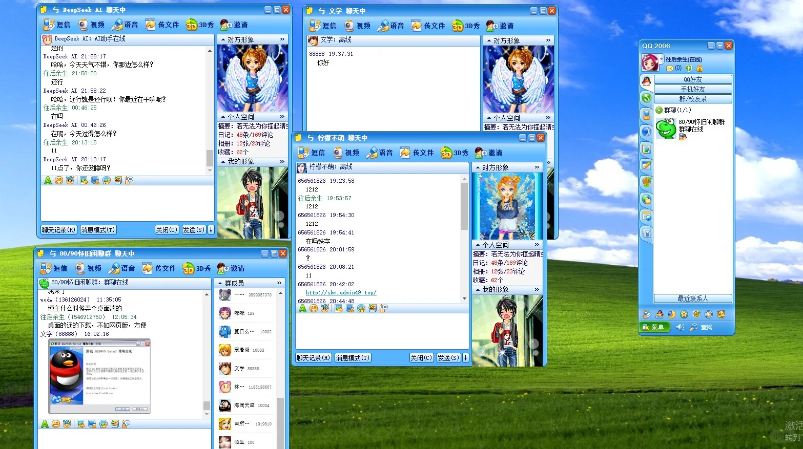

# QQ_agentshow

把 macOS 上的 Codex / ChatGPT Desktop 变成一套 QQ2006/2007 风格的 Agent 工作台：蓝色玻璃窗口、QQ 好友右栏、会动的小企鹅、QQ 秀、经典提示音，以及仍然完整可用的原生 Codex 输入框、附件、模型和权限控件。

> 非官方怀旧项目。与 OpenAI、Tencent、QQ 无隶属、授权或背书关系。项目不会修改 `ChatGPT.app` / `Codex.app`、`app.asar` 或应用签名。

<p align="center">
  
</p>

<p align="center">
  <a href="https://github.com/tangyihang-jiayou/QQ_agentshow/releases/latest"></a>
  <a href="https://github.com/tangyihang-jiayou/QQ_agentshow/actions/workflows/ci.yml"></a>
  <a href="LICENSE"></a>
  
  
</p>

## 它想还原什么

不是现代 UI 上贴一层蓝色滤镜，而是尽量复刻“打开 QQ 就有人在线”的感觉：顶部工具栏、好友资料卡、最近对话、个人空间、QQ 秀和底部状态栏都在，但里面显示的是你的 Codex 工作状态。

<p align="center">
  
  
</p>

## 现在能做什么

- 右侧“Codex 好友”只读取当前本地界面：任务状态、最近产物、来源、最近对话，不伪造好友或消息。
- 顶部工具栏复刻 QQ 时代的按钮密度：新建任务、已安排、插件、站点、拉取请求、聊天、换肤。
- 输入框保留 Codex 原生能力：文本、图片/文件、多图删除、模型选择、权限选择、语音和发送按钮都还是原来的。
- 小企鹅会随机呼吸、点头、挥手、探头、踱步、跳跃；任务完成时会庆祝。
- 主 Agent 完成任务响一次完成声；出现需要你确认/允许/继续的操作时响一次确认声。
- QQ 秀默认提供历史感的女/男模板；也可以本地替换成自己的透明 PNG。
- 右栏可以展开、收起、关闭，支持 `classic-chat`、`workbench`、`minimal` 三套布局。
- 随时点“换肤”回到原生界面；完整恢复也不会动官方 App 包。

## 30 秒安装

要求：macOS + 官方 ChatGPT / Codex Desktop。第一次安装前，请先正常打开一次 Codex，再从菜单栏完全退出。

```bash
/bin/bash -c "$(curl -fsSL https://raw.githubusercontent.com/tangyihang-jiayou/QQ_agentshow/v2.1.2/install.sh)"
```

安装后重新打开 Codex。看到顶部“换肤”和右侧“Codex 好友 / 环境信息”，就说明它已经接管外观了。

如果你想先审阅脚本：

```bash
git clone --branch v2.1.2 --depth 1 https://github.com/tangyihang-jiayou/QQ_agentshow.git
cd QQ_agentshow
./install.sh --check
./install.sh --no-launch
```

然后手动启动：

```bash
~/.codex/codex-dream-skin-studio/scripts/start-dream-skin-macos.sh --prompt-restart
```

## 常用配置

```bash
~/.codex/codex-dream-skin-studio/scripts/personalize-codex-2007-macos.sh \
  --agent-layout classic-chat \
  --pet-motion playful \
  --conversation-preview real \
  --completion-sound on
```

几个常用开关：

| 选项 | 可选值 | 说明 |
| --- | --- | --- |
| `--agent-layout` | `classic-chat` / `workbench` / `minimal` | 右栏信息密度 |
| `--pet-motion` | `calm` / `playful` / `off` | 小企鹅动作强度 |
| `--conversation-preview` | `real` / `masked` / `off` | 最近对话展示方式 |
| `--completion-sound` | `on` / `off` | 完成声和确认声 |
| `--qq-show` | `girl` / `boy` / 本地 PNG 路径 | QQ 秀默认形象 |

完整配置见 [docs/CONFIGURATION.md](docs/CONFIGURATION.md)。

## 声音什么时候响

| 场景 | 行为 |
| --- | --- |
| 主 Agent 从运行变成完成 | 播放完成声，小企鹅庆祝 |
| 第一次出现允许 / 确认 / 继续 / 运行 / 提交等人工操作 | 播放确认声 |
| 同一张确认卡重复刷新 | 不重复播放 |
| Codex 在后台、隐藏或窗口未聚焦 | 不播放 |

底部状态栏有“完成声 / 确认声”试听按钮。当前默认声音来自维护者选择的历史 QQ 时代素材，并做了去直流、淡入淡出、保守降噪和削波检查，尽量保留复古味道但不再有明显电流声。

## 隐私与安全边界

- 只读当前本地 Codex DOM，不上传、不采集、不写回你的聊天记录。
- 不修改官方应用包、`app.asar`、签名、会话、API Key、Base URL 或模型配置。
- 使用官方 App 内签名有效的 Node.js，不下载第三方运行时。
- 本地调试端口只绑定回环地址；不用时可以恢复原生界面并关闭监听器。
- README 主图是维护者主动提供的真实运行截图；产品本身不会自动生成或上传截图。

恢复命令：

```bash
~/.codex/codex-dream-skin-studio/scripts/restore-dream-skin-macos.sh \
  --restore-base-theme --restart-codex
```

更多说明见 [docs/INSTALLATION.md](docs/INSTALLATION.md)、[docs/TROUBLESHOOTING.md](docs/TROUBLESHOOTING.md)、[docs/PRIVACY.md](docs/PRIVACY.md)。

## 作为 Codex Skill 使用

仓库根目录的 [SKILL.md](SKILL.md) 就是正式的 `QQ_agentshow` Skill。把这个仓库交给 Codex，它可以按 Skill 完成预检、安装、配置、验证、排错和恢复。

## 开发检查

```bash
cd macos
npm test
npm run privacy
npm run assets:check
npm run skill:check
```

## 来源与许可

本项目从 [Fei-Away/Codex-Dream-Skin](https://github.com/Fei-Away/Codex-Dream-Skin) 的 macOS 运行引擎继续开发，软件代码沿用 MIT License。

默认企鹅、QQ 秀、提示音和 README 里的复古目标图属于历史 QQ 时代怀旧素材或维护者提供素材，不属于本项目原创，也不包含在 MIT 授权范围内；本项目不声称获得 Tencent / QQ 官方许可。`Codex`、`OpenAI`、`QQ`、`Tencent` 及相关标识归各自权利人所有。详见 [NOTICE.md](NOTICE.md) 与 [macos/references/asset-provenance.md](macos/references/asset-provenance.md)。
